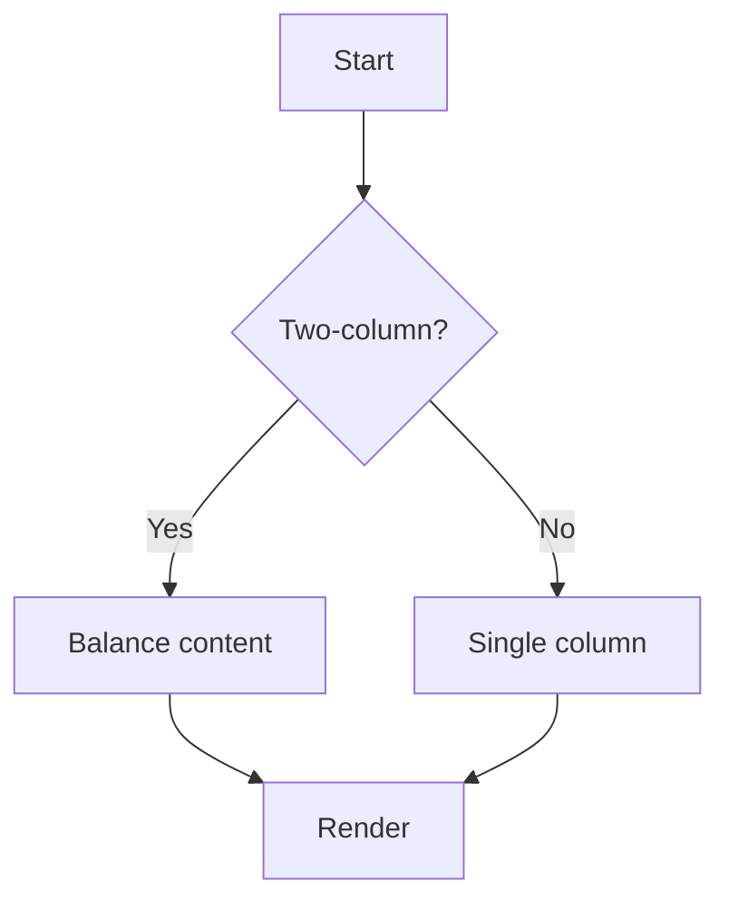

<!--
This markdown demonstrates the slide deck functionality:
- Front matter `slides: true` enables slides mode.
- Slides are separated by lines containing only `---` (outside code fences).
- Two-column auto layout may activate on wide viewports when content fits well.
- Oversized blocks (code, table, mermaid, images) disable two-column to avoid clipping.
- Keyboard navigation: ← →, PageUp/PageDown, Home/End. Click on background advances.
- Hash deep-linking: #slide-1, #slide-2, etc.
-->

# Slides Feature Demo

## Slide 1 — Introduction

Welcome to the Slides Feature Demo.

- Use left/right arrow keys to navigate.
- Resize the window to test the two-column threshold.
- Some slides will enable two columns automatically when suitable.

<!--
Tip:
The threshold for auto two-column is configurable by the loader script attribute `data-two-col-min-width`,
if your HTML uses [boot.js](boot.js) to initialize rendering and sets that attribute.
-->

---

## Slide 2 — Two-column Stress Test

The content here is designed to be tall, but still appropriate for two-column layout on sufficiently wide viewports.

Paragraph text:
Lorem ipsum dolor sit amet, consectetur adipiscing elit. Integer in sapien sit amet risus tempor vulputate.
Nullam tincidunt, nisl ut varius interdum, purus orci bibendum odio, quis rhoncus sem magna id elit.
Sed vitae urna et sapien maximus sodales. Nunc vitae semper lorem. Proin malesuada dolor at leo feugiat.

Bullet list to increase height:
- Item 1 with some descriptive text to add height.
- Item 2 with some descriptive text to add height.
- Item 3 with some descriptive text to add height.
- Item 4 with some descriptive text to add height.
- Item 5 with some descriptive text to add height.
- Item 6 with some descriptive text to add height.
- Item 7 with some descriptive text to add height.
- Item 8 with some descriptive text to add height.
- Item 9 with some descriptive text to add height.
- Item 10 with some descriptive text to add height.
- Item 11 with some descriptive text to add height.
- Item 12 with some descriptive text to add height.
- Item 13 with some descriptive text to add height.
- Item 14 with some descriptive text to add height.
- Item 15 with some descriptive text to add height.
- Item 16 with some descriptive text to add height.
- Item 17 with some descriptive text to add height.
- Item 18 with some descriptive text to add height.

<!-- Two-column should activate when viewport is wide enough, total content fits into two columns, and no oversized blocks exist. -->

---

## Slide 3 — Oversized Code Block (Disables Two-column)

Below is a tall code block. The layout logic should detect an oversized unbreakable block and revert to single column to prevent clipping.

```js
// Repeated lines to grow height significantly
function example(i) { return 'line ' + i; }
// 1
// 2
// 3
// 4
// 5
// 6
// 7
// 8
// 9
// 10
// 11
// 12
// 13
// 14
// 15
// 16
// 17
// 18
// 19
// 20
// 21
// 22
// 23
// 24
// 25
// 26
// 27
// 28
// 29
// 30
```

<!-- Oversized block should force single-column to avoid clipping in multicol layout. -->

---

## Slide 4 — Table Test

| # | Item | Description |
|---:|------|-------------|
| 1 | Alpha | Description for alpha |
| 2 | Beta | Description for beta |
| 3 | Gamma | Description for gamma |
| 4 | Delta | Description for delta |
| 5 | Epsilon | Description for epsilon |
| 6 | Zeta | Description for zeta |
| 7 | Eta | Description for eta |
| 8 | Theta | Description for theta |
| 9 | Iota | Description for iota |
| 10 | Kappa | Description for kappa |

<!-- Table rows should not split across columns; break-inside: avoid is applied when two-col is active. -->

---

## Slide 5 — Mermaid Diagram



<!-- Mermaid diagrams render within slides. If the diagram height is large, two-column should be disabled automatically. -->

---

## Slide 6 — Image Example


This image is loaded directly from the internet using standard Markdown image syntax. It demonstrates how to embed external media in a slide. The picture is a generic example suitable for demos and documentation.

---

## Slide 7 — Closing

This final slide wraps up the demo. Use the Table of Contents (ToC) toggle button (☰) to jump to headings across slides.