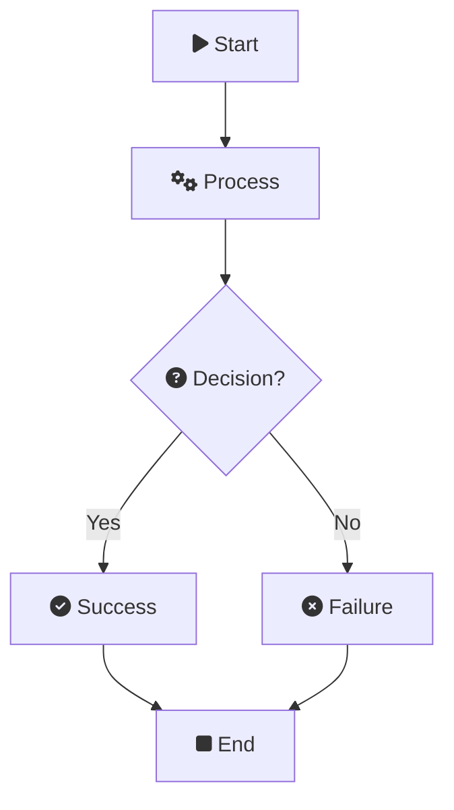
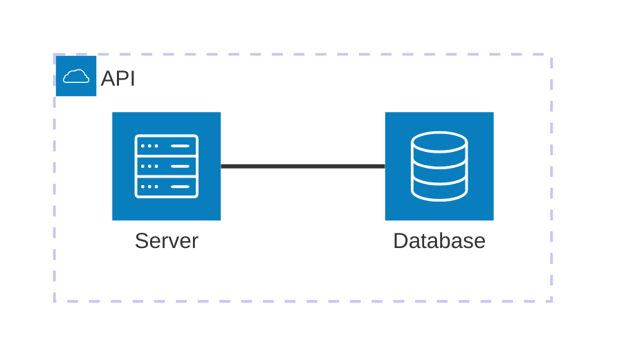

<!--
This markdown demonstrates:
- Sidebar Table of Contents (ToC) built from headings
- Citations [@key] and footnotes [^id]
- GitHub-style tables
- Mermaid diagrams with Iconify icons in flowchart and architecture-beta
-->

# Overview

This document shows how features are rendered. The sidebar ToC is generated automatically from the headings below; you can toggle it using the ☰ button in top right.

## Citations and Footnotes

Cite two entries [@alpha2020] and [@beta2019] in this sentence. Also a footnote appears here [^note1].

Another paragraph with a second footnote [^note2] and a link.

<!-- Tip: You can provide a BibTeX file via YAML front matter 'bibliography: ./file.bib'.
     When not provided, the References section will list citation keys as plain text. -->

## Table Example

| Name | Value | Notes |
|------|------:|-------|
| Alpha | 123 | Sample row |
| Beta | 456 | Another sample |
| Gamma | 789 | Yet another |

<!-- Tables are rendered with GitHub styles; when forced light theme, table colors are light. -->

## Mermaid: Flowchart with Icons

<!--
Generic flowchart using Font Awesome 4 icon syntax (fa:fa-<name>) in nodes.
This example is compatible with FA4 icon support; other icon packs may require an icon plugin.
-->

## Mermaid: Architecture (beta) with Icons

<!-- architecture-beta is supported in Mermaid 11.1+. This example uses built-in icons (cloud, database, server). -->

## Mermaid: Architecture (beta) with Logos Icons

<!--
This example uses the Iconify "logos" collection in architecture-beta.
The runtime will detect "logos:" in the markdown and lazily register the pack
via the icon runtime ([icon.js](icon.js:1) and [lib/loader.js.buildIconPack()](lib/loader.js:194)).
-->

```mermaid
architecture-beta
  group api(logos:aws-lambda)[API]
    service db(logos:aws-aurora)[Database] in api
    service storage(logos:aws-s3)[Object Storage] in api
    service server(logos:aws-ec2)[Compute] in api

  db:L -- R:server
  storage:T -- B:db
```

## Closing

This section exists to further demonstrate the ToC linking and highlighting behavior.

<!-- Footnote definitions are stripped from the body and shown in a Footnotes section at the end. -->

[^note1]: This is a sample footnote defined inline to appear in the Footnotes section.
    Continuation line for footnote note1 (indented).
[^note2]: Another footnote. Appears with a contextual [Back] link near its reference.